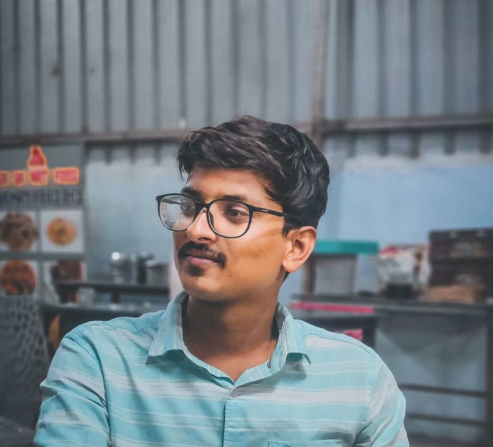

# Neeraj Komatishetti

<link rel="stylesheet" href="https://cdnjs.cloudflare.com/ajax/libs/font-awesome/6.0.0-beta3/css/all.min.css">

- **Email**: [Email](mailto:neerajkomatishetti@gmail.com)
- **LinkedIn**: [Neeraj Komatishetti](https://www.linkedin.com/in/neeraj-komatishetti-639ab32a8)
- **Portfolio**: [Neeraj Komatishetti](https://portfolio-phi-red-81.vercel.app/)
## About Me

I'm a computer science student who is really into technology and innovation. I've learned a good amount about coding in Java and Python, and I love figuring out tricky problems. I'm always looking to learn new things and come up with fresh ideas. I'm searching for an internship to gain real-world experience and understand how companies work. I'm eager to pick up new skills and grow in my field. I'm confident I can be a valuable asset to any team and will work hard to deliver great results.

# Technologies I Use

### Tools

### Libraries & Frameworks

## Education

- **B.Tech**: *2022 - 2025*
  - B.Tech in Computer Science Engineering from TKR College of Engineering & Technology at Meerpet, Rangareddy(D), Hyderabad.
- **Diploma**: *2019 - 2022*
  - Completed Diploma in Computer Science from TKR College of Engineering & Technology at Meerpet, Rangareddy(D), Hyderabad, with 8.4 CGPA.
- **SSC**: *2019*
  - Completed Secondary Education from Krishnaveni High School, Balkonda, Nizamabad, with 9.8 GPA.

## Courses

1. Learn Complete Python in Simple Way, from Udemy

## Skills

1. Python programming
2. Machine Learning
3. Full Stack Web Development
4. Data Structures and Algorithms (DSA)
5. C++, C, Java, SQL, PostgreSql, Mongodb, prisma.
6. JavaScript, TypeScript
7. MERN Stack

## Projects

### A DonationOS
- DonateOS(overseas) is a platform built for Registering Donations to foreign countries.
- Developed using TypeScript and NEXTJS for frontend
- HONO, Cloudflare workers for backend
- Uses Postgres as the Primary DB
- And uses Supabase Storage for storing images

### Paytm Clone
- Developed a full-stack fintech app using Node.js, MongoDB, and Vite with JWT-based authentication.
- Enabled secure money transfers, real-time balance updates, and transaction history tracking.
- Architected modular REST APIs and integrated frontend/backend with environment-based routing.
- Containerized the app using Docker for seamless cross-platform deployment.
- Designed for fast local setup and scalable prototyping of financial services.

### Full Stack Todo
- Built a full-stack Todo application using Node.js, Express, and React with custom styling and responsive UI.
- Implemented CRUD operations, user-friendly task management, and dynamic state updates.
- Deployed on Vercel with optimized frontend/backend integration for fast performance.
- Designed for scalability and clean code structure—ideal for showcasing full-stack proficiency

### Machine Learning Model for MNIST Dataset
Developed a machine learning model to predict digits from the MNIST dataset, a large database of handwritten digits. This project involved:
- **Data Preprocessing**: Normalizing and preparing the dataset for training.
- **Model Training**: Using TensorFlow to build and train a neural network.
- **Evaluation and Optimization**: Assessing model performance and fine-tuning hyperparameters to improve accuracy.
This project enhanced my understanding of machine learning concepts and practical implementation using Python and TensorFlow.

## Languages

1. English
2. Hindi
3. Telugu
